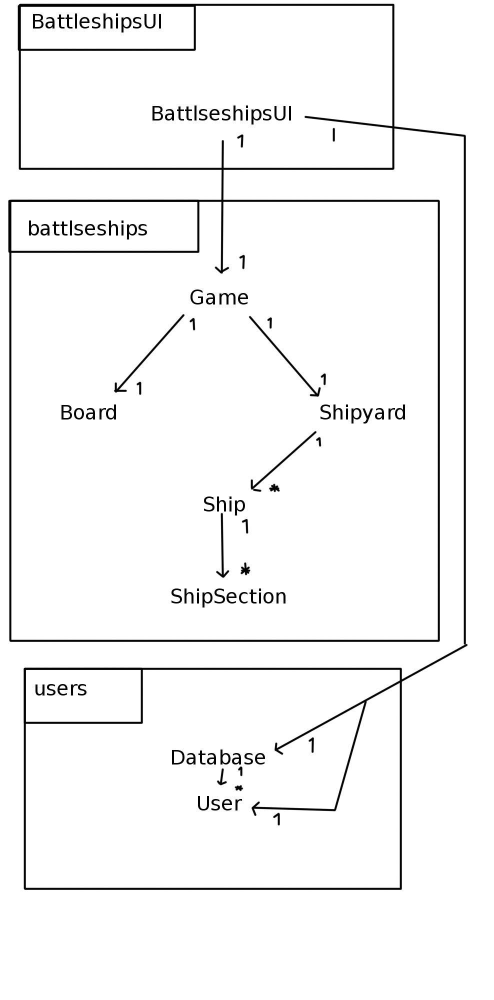

# Arkkitehtuurikuvaus

## Rakenne

Koodin pakkausrakenne:

### Battleships.BattleshipsUI:

Sisältää käyttöliittymän joka on toteutettu javafx:ällä.

### Battleships.battleships:

Sisältää sovellus logiikan

### Battleships.users:

Sisältää käyttäjien hallinnan ja pysyväis tallennuksen.

## Käyttöliittymä

Käyttöliittymä sisältää 5 erillistä näkymää, jotka on toteutettu seuraavina stage olioina.

- Päävalikko
- Vaikeuden valinta (ennen pelin alkua)
- Peliruutu
- Vaikeuden valinta (ennen ennätyslitan esitystä)
- Ennätyslista

Käyttöliittymä on toteutettu ohjelmallisesti luokassa Battleships.BattleshipsUI.BattleshipsUI, jossa scene oliot asetetaan yksi kerrallaan näytettäväksi sovelluksen stageen.

Pelatakseen peliä käyttöliittymä kutsuu sovelluslogiikan metodeja luokasta Game.  

Kun uusi käyttäjä lisätään päävalikossa tai ennätyslistaa katsellaan niin käyttöliittymä kutsuu users.database luokkaa jossa käyttäjien pysyväistallennus ja käyttäjä tietojen haku suoritetaan.

## Sovelluslogiikka  

Sovelluksen loogisen datamallin muodostavat luokat: Game, Board, Ship, ShipSection ja Shipyard.

Sovelluksen Loogiset toiminnallisuudet käyttöliittymälle tarjoaa luokan Game olio, nämä metodit ovat get metodien, kuten getTurns() lisäksi: hit(), didYouWin() ja didYouLose().  

Käyttöliittymä pystyy database luokan olion avulla tallentaa ja noutaa käyttäjien tiedot käyttäjä olio listana. Kaikki käyttäjien tiedot ladataan database luokan konstruktori kutsun yhteydessä.

Battleships luokat luokka/pakkauskaavio:

## Tietojen pysyväistallennus

Pakkauksen Battleships/users luokka Database tarjoaa metodit käyttäjä olioiden tallennukseen ja noutoon.
luokka noutaa tiedostolta käyttäjien tiedot ja muuntaa ne luokan User olioiksi.
Käyttöliittymä kutsuu Database luokan konstruktoria joka lukee kaikki käyttäjät tiedostolta sovelluksen käynnistyksessä ja metodia save() joka tallentaa
kaikki käyttäjät tiedostoon.
Tallennus metodi save() kutsutaan aina kun käyttäjiin tehdään jokin muutos.

### Tiedosto

Pysyväistallennuksen tiedostona toimii userfile.txt johon käyttäjien tiedot tallennetaan muodossa:
 nimi;helpot voitot;normaalit voitot;vaikeat voitot

nimi on muotoa String ja voitot Integer numeroilla, jotka kaikki ovat eroteltuina merkillä ";".

## Päätoiminnallisuudet

Sekvenssikaaviot sovelluksen päätoiminnoista.

### Käyttäjän nouto

Käyttäjän kirjoitettuaan nimensä alempaan tekstikenttään ja painettuaan nappia "choose", käyttöliittymä hakee Database luokan oliolta listan käyttäjistä ja löydettyään oikean asettaa tämän käyttäjän tiedot esille peliruutuun.

### Pelin alku 

Käyttäjän kirjauduttua ja valittuaan vaikeusasteen peli alkaa käyttöliittymän muodostettua Game olion tässä esimerkissä vaikeudella "Easy".

### Laivaan osutaan

Käyttäjän saatuaan kolmannen osuman helppoon kolmen pituiseen laivaan laiva nähdään uponneeksi ja ehjiä laivoja on yksi vähemmän.

### Ennätyslista

Kun käyttäjä valitsee päävalikon alimman napin "Leaderboards" ja valitsee katseltavaksi vaikeus asteeksi "Easy", jolloin hänelle näytetään parhaat viisi käyttäjää ja heidän ennätyksensä.

## Ohjelman rakenteeseen jääneet heikkoudet

### käyttöliittymä

Graafisesti käyttöliittymä ei ole vaikuttava eikä laivojen osumat erotu kunnolla kun laivoja on liikaa.

### Database luokka

Database luokka olisi voinut tehdä täysin DAO tyylisesti

### Board luokka

Board luokka olisi voinut toteuttaa laivojen sijoittelun myös siten että laivat suuntaisivat eri suuntiin eikä vain eteenpäin.

### Nimet

Luokkien ja pakettien nimet olisi pitänyt toteuttaa eri tyylillä käyttäen nimiä kuten domain ja DAO. 
