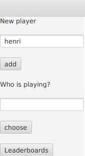
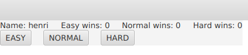
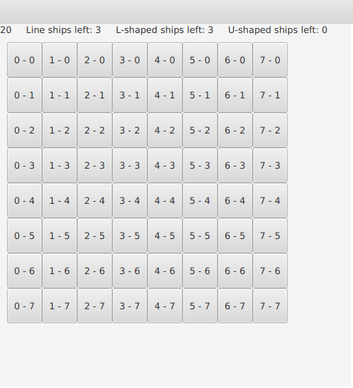
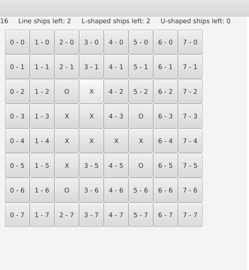

# *Käyttöohje*

Lataa tiedosto [Battleships.jar](https://github.com/Radiant92/otm-harjoitustyo/releases/tag/viikko6)

# Ohjelman käynnistäminen

Ohjelma käynnistetään komennolla "java -jar Battleships-2.0.jar"

# Päävalikko

Sovellus käynnistyy päävalikkoon, jossa käyttäjä voi luoda uuden tilin syöttämällä ylempään
tekstikenttään ("New player" tekstin alle) haluamansa nimen ja painamalla tekstikentän alla olevaa nappia jossa lukee "add"

Lisättyään ainakin yhden tilin, käyttäjä voi nyt syöttää tilin nimen alempaan tekstikenttään ("Who is playing?" tekstin alle)
ja painaa tämän alla olevaa "choose" nappia, joka vie käyttäjän seuraavaan ikkunaan jossa käyttäjä
valitsee pelin vaikeusasteen.

Lopuksi päävalikosta pääsee katsomaan käyttäjien ennätyksiä painamalla alimmaista nappia jossa lukee: "Leaderboards". 

# Peli

Ennen pelin alkua käyttäjä valitsee vaikeusasteen kolmesta vaihtoehdosta: easy (helppo), normal (normaali), hard (vaikea).
Tässä ikkunassa pelaaja näkee ruudun yläreunalla hänen nimensä sekä voittojen määrän eri vaikeus asteilla.

### Helppo

Helpolla vaikeusasteella käyttäjän on löydettävä kartalta kolme kolmen ruudun pituista suoraa laivaa tehden vain kymmenen
arvausta väärin.
kartan koko on 36 ruutua.

### Normaali

Normaalilla vaikeusasteella käyttäjän on löydettävä kolmen kolmen ruudun pituisten laivojen lisäksi kolme L:än muotoista
viiden ruudun pituista laivaa tehden vain 20 arvausta väärin.
kartan koko on 64 ruutua.

### Vaikea

Vaikeimmalla vaikeusasteella käyttäjän on löydettävä kolmen suoran ja L:än muotoisten laivojen lisäksi myös kolme 
U:n muotoista seitsemän ruudun pituista laivaa tehden vain 25 arvausta väärin.
kartan koko on 100 ruutua.

Painettuaan hiirellä haluamansa vaikeusasteen, käyttäjä siirretään peli ikkunaan.
Peli ikkunan yläreunassa näkyy pelaajan jäljellä oleva arvausten määrä sekä jäljellä olevien laivojen määrät.

kuva normaalin pelin alusta:

Peli ikkunan keskellä on nelikulmainen ruudukko numeroituja nappeja, joka edustaa pelilautaa.
Numeroituja nappeja painamalla käyttäjä arvailee laivojen sijainteja, jos painetun napin teksti muuttuu kirjaimeksi "O"
on arvaus mennyt väärin ja käyttäjän arvausten määrä vähenee yhdellä.

Kun taas käyttäjä painaa nappia, joka muuttuu kirjaimeksi "X" on laivaan osuttu.
Osuttuaan kaikkiin laivan kohtiin, laiva uppoaa ja kyseisen laivan tyypin määrä vähenee yhdellä.

Nappi joka on "X" tai "O" ei enää tee mitään vaikka sitä painettaisiin.

kuvassa peli josta on löytynyt yksi suora laiva ja yksi L:muotoinen laiva:

Peli loppuu kun joko kaikki arvaukset on käytetty (Laskuri menee nollaan) tai kun käyttäjä voittaa, eli onnistuu upottamaan
kaikki pelilaudan laivat.

Pelin loputtua käyttäjä viedään takaisin päävalikkoon.

# Ennätyslista

Painamalla päävalikon alinta nappia käyttäjä siirtyy ikkunaan, josta hän voi valita kolmesta vaikeusasteesta minkä
vaikeuden ennätyksiä hän haluaa katsoa, tai painaa alinta "back" paluu nappia, josta hän palaa takaisin päävalikkoon.

Kaikkien vaikeusasteiden ennätyslistat näyttävät enintään viisi käyttäjää joilla on eniten voittoja siinä vaikeusasteessa.

kuvassa valittu normaalin vaikeuden ennätyslista, jossa henrillä näkyy olevan yksi voitto ja käyttäjällä j jolla ei ole voittoa
lainkaan:

Listan alla on nappi jota painamalla käyttäjä viedään takaisin ennätys valikko ikkunaan.
 

 

