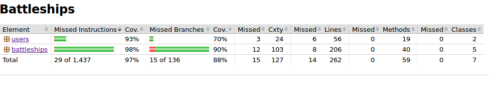

# Testausdokumentti

Testi luokkia on tehty molemmille paketeille users ja battleships

## users luokat

### User luokka

User luokkan testaukseen on riittänyt yksinkertaiset get testit, koska luokka ei tee sen kummempaa kuin luo User olioita Databasen ja käyttöliittymän avuksi.

### Database luokka

Database sen sijaan testaa kirjoittamalla tyhjään tiedostoon uusia käyttäjiä, käyttäjien tallennusta ja ennalta täytetyn käyttäjä listan lukemista sekä järjestämistä voittojen mukaan.

## battleships luokat

### Shipyard, Ship ja ShipSection

nämä luokat ovat pääosin laivojen hallintaan tarkoitettuja ja niiden ideana on tuottaa ja edustaa laivoja ja niiden osia, jolloin ainoina testattavina asioina on tiedon nouto ja laivojen rakennus käskyt.

### Game ja Board

pääosa testauksesta tapahtuu Game ja Board luokassa, jossa Game luokan testit ovat pääosin uuden pelin luomista sekä pelin etenemisen testailua, kun taas Board luokka jossa testailun kohteena on laivojen oikein sijoittelu sekä varmistaa, että riittävän monta laivaa onnistutaan sijoittamaan laudalle.

## Testikattavuus

Käyttöliittymää lukuunottamatta sovelluksen testauksen rivikattavuus on 97% ja haarautuma kattavuus 88%

  
